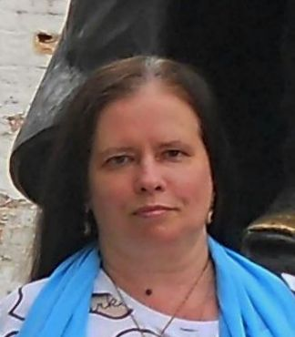

# Середницкая Светлана Викторовна

Я учусь в Нетологии.

Изучаю Python, Git, 1С программирование.

В процессе обучения планирую полностью перейти в сферу IT - уж слишком интересная тема.

Знакома с Excel.

На данный момент работаю оператором, Почта России, уже 12 лет. Интересная работа, важная и нужная для как для отдельных людей, так и для человечества в целом.

А главное, не скучно - всегда есть чем заняться. 
Например, несколько лет назад создала в Excel систему документов, позволяющих руководителю почтового отделения вести учет движения денежных средств и создавать необходимые отчеты.

